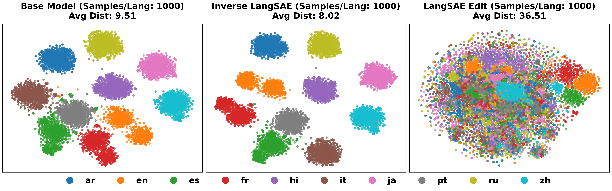

# LangSAE Editing: Improving Multilingual Information Retrieval via Post-hoc Language Identity Removal

[](https://arxiv.org/abs/2601.04768)
[](LICENSE)
[](https://www.python.org/downloads/)

This repository contains the code for the arXiv preprint **“LANGSAE EDITING: Improving Multilingual Information Retrieval via Post-hoc Language Identity Removal”** ([arXiv:2601.04768](https://arxiv.org/abs/2601.04768)).

LangSAE Editing is a post-hoc method that operates directly on pooled sentence embeddings. It trains an overcomplete sparse autoencoder (SAE) on embeddings, identifies language-associated latent units using cross-language activation statistics, suppresses these units at inference time, and reconstructs embeddings in the original dimensionality for drop-in cosine similarity search.

## Overview

Multilingual encoders often encode both semantics and language identity. In mixed-language retrieval pools, language identity can act as a shortcut and inflate same-language similarities, crowding out relevant evidence written in other languages.

LangSAE Editing addresses this without retraining the base encoder or re-encoding the corpus from raw text:

- **Train** a sparse autoencoder on pooled embeddings.
- **Diagnose** language-associated latent units via activation statistics across languages.
- **Edit** embeddings by suppressing selected units.
- **Reconstruct** back to the original embedding dimensionality so the edited vectors are compatible with existing vector databases.

## Methodology


The LangSAE Editing pipeline consists of three main stages:

1. **Training**: Train a sparse autoencoder on pooled sentence embeddings from a multilingual encoder
2. **Analysis**: Identify language-associated features by analyzing activation patterns across different languages
3. **Editing**: Suppress language-specific features and reconstruct embeddings in the original dimensionality

## Repository Contents

- **Training**: `LangSAE/main.py`, `LangSAE/train.py`, `LangSAE/model.py`
- **Activation extraction** (fast path uses vLLM): `LangSAE/data.py`
- **Mask generation (analysis)**: `LangSAE/analyze_main.py`, `LangSAE/analyze.py`
- **Editing / inference**: `LangSAE/inference_main.py`, `LangSAE/inference.py`

Note: datasets, cached activations, checkpoints, W&B logs, and analysis outputs are excluded from version control (see `.gitignore`).

## Project Structure

```text
LangSAE-Editing/
├── LangSAE/                  # Python package
│   ├── main.py               # Training CLI (Fire)
│   ├── model.py              # LangSAE model definition
│   ├── train.py              # Training loop
│   ├── data.py               # Data loading + activation extraction (vLLM/HF)
│   ├── analyze_main.py       # Mask generation CLI (Fire)
│   ├── analyze.py            # Language feature analysis
│   ├── inference_main.py     # Editing / inference CLI (Fire)
│   └── inference.py          # Editing utilities
├── data/
│   └── download_data.py      # Optional dataset preparation script
├── run_main.py               # Wrapper to force multiprocessing spawn (vLLM safety)
├── run_sweep.sh              # Training sweep helper
├── pyproject.toml            # Package metadata / dependencies
├── LICENSE                   # MIT License
└── README.md
```

## Quick Start

### Prerequisites

- Python 3.11+
- CUDA-capable GPU(s) recommended

### Installation

```bash
# With uv (recommended)
uv pip install -e .

# Or with pip
pip install -e .
```

### Train a LangSAE

```bash
uv run -m LangSAE.main \
  --model="intfloat/multilingual-e5-large" \
  --dataset="./data/train.jsonl" \
  --val_dataset="./data/val.jsonl" \
  --use_vllm=True \
  --num_gpus=8 \
  --gpu_memory_utilization=0.9
```

### (Optional) Multi-GPU training (DDP)

```bash
uv run torchrun --standalone --nproc_per_node=8 -m LangSAE.main \
  --num_gpus=8 \
  --model="intfloat/multilingual-e5-large" \
  --dataset="./data/train.jsonl" \
  --val_dataset="./data/val.jsonl" \
  --use_vllm=True
```

### Generate a language mask (analysis)

The paper finds that suppressing overlapping (cross-language) frequent features can be important; you can include overlaps by setting `--exclude_overlapping_features=False`.

```bash
uv run -m LangSAE.analyze_main \
  --sae_path="./checkpoints/.../final_model.pt" \
  --validation_data="./data/val.jsonl" \
  --model="intfloat/multilingual-e5-large" \
  --mask_threshold=0.95 \
  --exclude_overlapping_features=False \
  --use_vllm=True \
  --num_gpus=8
```

### Edit embeddings (inference)

#### Option A: Edit precomputed activations (vector-only)

```bash
uv run -m LangSAE.inference_main from_activations \
  --activations_path="./activations/.../model.pt" \
  --sae_path="./checkpoints/.../final_model.pt" \
  --mask_path="./analysis/.../language_features_combined_mask.pt" \
  --output_path="./embeddings/edited.pt" \
  --batch_size=4096
```

#### Option B: Edit from raw text (encode + edit)

```bash
uv run -m LangSAE.inference_main from_text \
  --model_name="intfloat/multilingual-e5-large" \
  --sae_path="./checkpoints/.../final_model.pt" \
  --mask_path="./analysis/.../language_features_combined_mask.pt" \
  --text_file="./data/queries.txt" \
  --output_path="./embeddings/queries_edited.pt" \
  --batch_size=32 \
  --max_length=512 \
  --use_vllm=True \
  --num_gpus=8
```

### Troubleshooting (vLLM + multiprocessing)

If you hit CUDA/fork multiprocessing issues, use the wrapper script (it forces the `spawn` start method before importing LangSAE):

```bash
python3 run_main.py --model="..." --dataset="..."
```

## Results & Visualizations

The method shows consistent improvements in ranking quality and cross-language coverage, with especially strong gains for script-distinct languages. The following visualization shows language clustering in the embedding space:



## Citation

If you use this code, please cite:

```bibtex
@article{kim2026langsae_editing,
  title={LANGSAE EDITING: Improving Multilingual Information Retrieval via Post-hoc Language Identity Removal},
  author={Kim, Dongjun and Yoon, Jeongho and Park, Chanjun and Lim, Heuiseok},
  journal={arXiv preprint arXiv:2601.04768},
  year={2026},
  url={https://arxiv.org/abs/2601.04768},
  doi={10.48550/arXiv.2601.04768}
}
```

## License

This project is licensed under the MIT License. See `LICENSE` for details.
